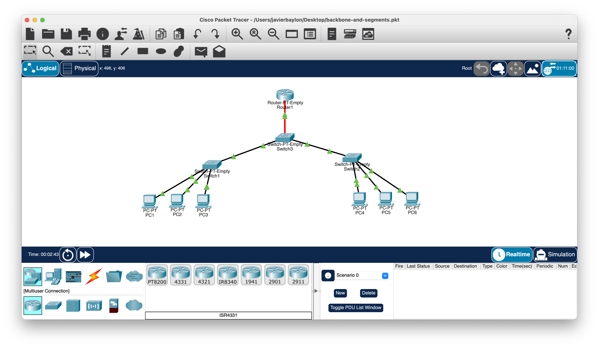

# Lab 02: Network Backbone and Segments

## Objective

Build a small network in Cisco Packet Tracer to understand the purpose of network segments, backbone infrastructure, and higher-speed uplinks.

## Lab Environment

- Cisco Packet Tracer
- PCs
- Access switches
- Core switch
- Router
- Fast Ethernet
- Gigabit Ethernet
- Multimode fiber

## Topology

## Network Design

I created two network segments connected to a central core switch.

Each segment contains PCs connected to an access switch using Fast Ethernet. The access switches connect to the core switch using Gigabit Ethernet uplinks.

The core switch connects to the router using multimode fiber.

## Backbone and Segments

The access switches provide connectivity for devices within each network segment.

Higher-speed Gigabit Ethernet uplinks connect the access switches to the core switch. This allows the uplinks to carry aggregated traffic from multiple devices.

The core infrastructure acts as the backbone connecting the different portions of the network.

## Connectivity Testing

I verified connectivity between devices using `ping` and observed traffic moving through the topology using Packet Tracer Simulation Mode.

I also observed how traffic from an end device travels through the access layer toward the core of the network.

## What I Learned

- A network can be divided into smaller segments that connect through central network infrastructure.
- Access switches provide connectivity to end devices within a network segment.
- A backbone provides a central path for connecting different portions of a network.
- Uplinks commonly have more bandwidth because they may carry aggregated traffic from multiple end devices.
- Different connection speeds can be used at different parts of the network.
- Different physical media, such as copper Ethernet and fiber, can be used within the same network.
- Multimode fiber can be used for high-speed backbone or uplink connections.
- A network backbone describes the role of the infrastructure and does not require one specific cable type.

## Skills Practiced

- Network segmentation
- Backbone network concepts
- Access and core network design
- Fast Ethernet connectivity
- Gigabit Ethernet uplinks
- Multimode fiber connectivity
- Traffic aggregation concepts
- Cisco Packet Tracer topology design
- ICMP connectivity testing
- Packet Tracer Simulation Mode
