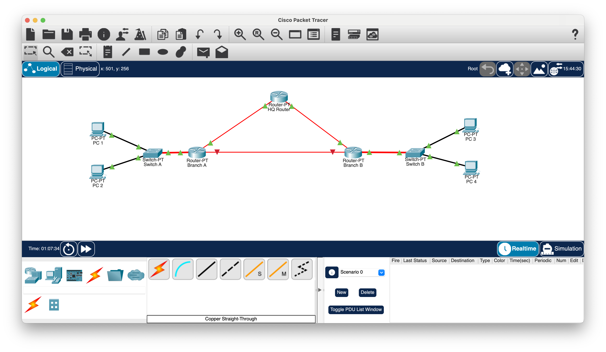

# Lab 03: Point-to-Point, Star, and Mesh Topologies

## Objective

Build and compare point-to-point, star/hub-and-spoke, and mesh network topologies in Cisco Packet Tracer.

The lab also demonstrates how a mesh topology provides redundant paths and how dynamic routing can automatically select an alternate route after a link failure.

## Lab Environment

- Cisco Packet Tracer
- 3 routers
  - HQ
  - Branch A
  - Branch B
- Switches
- PCs
- IPv4 addressing
- /30 point-to-point subnets
- RIPv2 dynamic routing

## Network Design

The network consists of an HQ location and two branch offices.

Each router is directly connected to the other two routers, creating a full mesh between the three locations.

```text
                  HQ
                 /  \
                /    \
               /      \
        Branch A──────Branch B
```

Each router-to-router connection is an individual point-to-point link.

Because every router has a direct connection to every other router, the overall WAN topology forms a full mesh.

Each location also contains PCs connected through a switch, demonstrating a star topology at the LAN level.

```text
                  HQ
                 /  \
                /    \
               /      \
        Branch A──────Branch B
            |             |
          Switch        Switch
          /   \          /   \
        PC     PC      PC     PC
```



## Point-to-Point Addressing

Each router-to-router connection was placed on a separate IP subnet.

I used `/30` networks because a traditional `/30` subnet provides two usable IPv4 addresses, making it useful for point-to-point links between two routers.

Example:

| Connection | Network |
|---|---|
| HQ ↔ Branch A | 10.0.0.0/30 |
| HQ ↔ Branch B | 10.0.0.4/30 |
| Branch A ↔ Branch B | 10.0.0.8/30 |

A `/30` uses the subnet mask:

```text
255.255.255.252
```

The network IDs increase in blocks of four:

```text
10.0.0.0/30
10.0.0.4/30
10.0.0.8/30
```

Using separate subnets prevents overlapping IP networks on the router interfaces.

## Default Gateways

Each PC was configured with a default gateway pointing to the router interface for its local network.

This was required for PCs to communicate with devices outside their own subnet.

```text
PC
 |
Switch
 |
Default Gateway
 |
Router
 |
Remote Networks
```

Without a correctly configured default gateway, the PCs could communicate locally but could not send traffic to remote networks.

## Dynamic Routing

I configured RIPv2 so the routers could dynamically exchange routing information.

Example configuration:

```text
router rip
 version 2
 network 10.0.0.0
```

The appropriate LAN networks were also advertised so that routers could learn how to reach PCs at the other locations.

I used the following command to examine the routing tables:

```text
show ip route
```

This allowed me to identify:

```text
C = Connected
L = Local
R = RIP
```

## Redundancy Test

To test the benefit of the mesh topology, I verified connectivity between a PC at Branch A and a PC at Branch B.

With all links operational, traffic could use the direct connection:

```text
Branch A ─────── Branch B
```

I then shut down the direct link between Branch A and Branch B.

```text
                  HQ
                 /  \
                /    \
               /      \
        Branch A -X- Branch B
```

After the routing information updated, communication between the branches continued using the alternate path:

```text
Branch A
    |
    HQ
    |
Branch B
```

I observed the routing tables change when the direct link was disabled and change again when the link was restored.

This demonstrated how a mesh topology combined with dynamic routing can provide network redundancy.

## What I Learned

- A point-to-point link directly connects two network endpoints.
- Multiple point-to-point links can form larger network topologies.
- A star topology connects devices to a central device such as a switch.
- A hub-and-spoke WAN connects multiple locations through a central location.
- A full mesh provides a direct connection between every participating node.
- Mesh topologies can provide alternate paths when a network link fails.
- Each routed point-to-point link requires its own IP subnet.
- A `/30` subnet provides two usable IPv4 addresses and is useful for traditional point-to-point addressing.
- PCs require a default gateway to communicate outside their local subnet.
- RIPv2 allows routers to dynamically exchange routing information.
- Routing tables change as network paths become available or unavailable.
- Dynamic routing protocols require time to converge after a topology change.
- Redundant physical links are only useful for IP connectivity when routing can make use of the alternate path.

## Skills Practiced

- Point-to-point networking
- Star topology
- Hub-and-spoke topology
- Full mesh topology
- Network redundancy
- IPv4 subnetting
- /30 subnet calculations
- Router interface addressing
- Default gateway configuration
- RIPv2 configuration
- Dynamic routing
- Routing table analysis
- `show ip route`
- Route convergence
- Link failure testing
- ICMP and `ping`
- Network troubleshooting
- Cisco Packet Tracer
