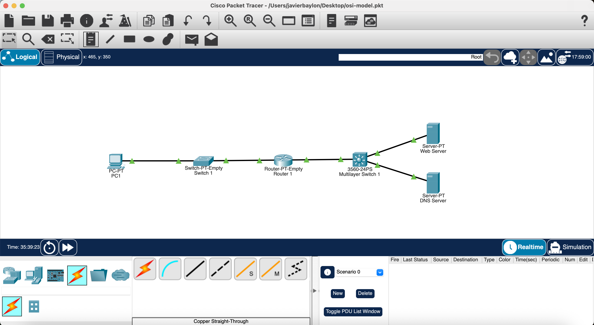
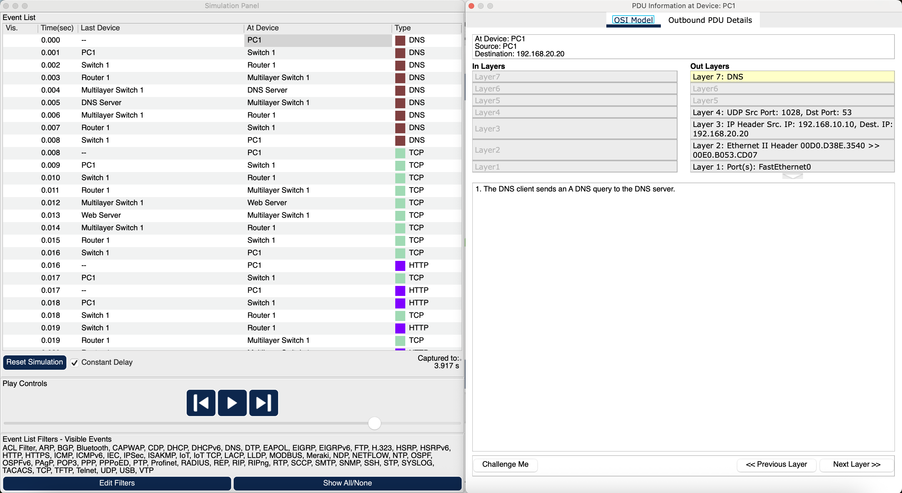
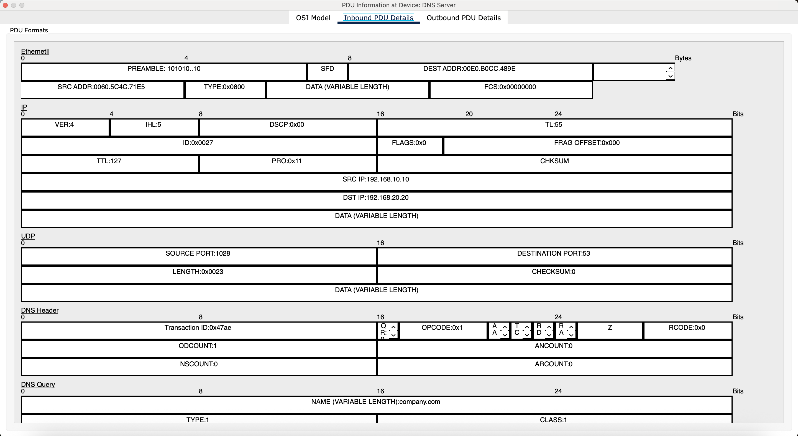

# Lab 05: OSI Model, Encapsulation & Web Communication

## Objective

Build a functional client-to-server network in Cisco Packet Tracer and use Simulation Mode to observe how network communication moves through the OSI model.

The lab focused on following a web request from beginning to end, including:

- DNS name resolution
- UDP communication
- Ethernet framing
- IPv4 routing
- TCP connection establishment
- HTTP communication
- TCP connection termination
- Encapsulation and decapsulation
- Layer 2 switching
- Layer 3 routing

---

## Lab Environment

- Cisco Packet Tracer
- Client PC
- Layer 2 switch
- Router
- Layer 3 / multilayer switch
- DNS server
- HTTP web server
- IPv4
- Ethernet
- ARP
- DNS
- UDP
- TCP
- HTTP

---

## Network Topology

The network was designed with the client and servers on different IP networks so traffic would have to pass through a router.



Example networks:

```text
Client Network
192.168.10.0/24

Server Network
192.168.20.0/24
```

The web server was configured to host a webpage.

A separate DNS server was configured with an A record that associated a domain name with the web server's IPv4 address.

Example:

```text
company.com → 192.168.20.10
```

This allowed the client to access the website using a domain name instead of entering the server's IP address directly.

---

# OSI Model Observation

Packet Tracer Simulation Mode was used to follow the communication between the client and servers.

The general encapsulation process observed was:

```text
Application Data
      ↓
Transport Segment/Datagram
      ↓
IP Packet
      ↓
Ethernet Frame
      ↓
Physical Transmission
```

At the destination, the process occurs in reverse:

This demonstrated the concepts of **encapsulation** and **decapsulation**.

---

# DNS Name Resolution

The first major event occurred when the client attempted to access:

```text
company.com
```

Before HTTP communication could begin, the client needed to determine the IP address associated with the domain.

The process was approximately:

```text
PC
 |
 | DNS Query
 ↓
DNS Server

"What is the IP address for company.com?"
        ↓
DNS Response

"company.com = 192.168.20.10"
```

After receiving the DNS A response, the client knew which web server IP address to contact.

---

# Layer 7 — Application

At Layer 7, the client generated a DNS query.

DNS provided the application-level mechanism for resolving:

```text
company.com
```

into an IPv4 address.

Later, HTTP operated at this layer to request the webpage from the web server.

Layers 5 and 6 were not displayed as separate operations for this communication in Packet Tracer.

---

# Layer 4 — UDP and DNS

The DNS query was transported using UDP.

The UDP header contained:

```text
Source Port
Destination Port
Length
Checksum
Data
```

The client used an ephemeral source port and sent the query to:

```text
UDP Destination Port 53
```

Port 53 identified the destination service as DNS.

The UDP payload contained the DNS message:

```text
UDP
└── DNS Header
    └── DNS Query
```

UDP provided a lightweight transport mechanism without establishing a connection before sending the DNS query.



---

# Layer 3 — IPv4

The UDP datagram was encapsulated inside an IPv4 packet.

Fields observed in the IPv4 header included:

```text
Version
IHL
DSCP
Total Length
Identification
Flags
Fragment Offset
TTL
Protocol
Checksum
Source IP
Destination IP
Data
```

## IPv4 Version

```text
VER = 4
```

identified the packet as IPv4.

## Internet Header Length

The observed value was:

```text
IHL = 5
```

IHL is measured in 32-bit words:

```text
5 × 4 bytes = 20-byte IPv4 header
```

IHL tells the receiving device where the IPv4 header ends and the payload begins.

## DSCP

DSCP can be used for Quality of Service and traffic prioritization.

The observed packet used:

```text
DSCP = 0
```

indicating no special traffic classification.

## TTL

The packet initially contained:

```text
TTL = 128
```

Each router forwarding an IPv4 packet decreases TTL by one.

```text
Before Router → TTL 128
After Router  → TTL 127
```

TTL prevents packets from circulating indefinitely because of routing loops.

## Protocol

The DNS packet showed:

```text
Protocol = 0x11
```

which corresponds to:

```text
17 = UDP
```

The IPv4 Protocol field identifies the Layer 4 protocol carried inside the packet.

Common examples include:

```text
1  = ICMP
6  = TCP
17 = UDP
```

---

# IPv4 Fragmentation Fields

The IPv4 header contained three related fragmentation fields:

```text
Identification
Flags
Fragment Offset
```

## Identification

Fragments belonging to the same original IPv4 packet share an Identification value.

```text
Fragment 1 → ID 100
Fragment 2 → ID 100
Fragment 3 → ID 100
```

This allows the destination to determine which fragments belong together.

## Flags

Important fragmentation flags include:

```text
DF = Don't Fragment
MF = More Fragments
```

DF prevents a packet from being fragmented.

MF indicates that additional fragments follow the current fragment.

## Fragment Offset

The Fragment Offset identifies where a fragment belongs within the original packet.

Together:

```text
Identification → Which packet?
Flags          → Fragmentation instructions
Fragment Offset→ Where does this piece belong?
```

---

# Layer 2 — Ethernet

The IPv4 packet was encapsulated inside an Ethernet frame.

The frame contained:

```text
Preamble
SFD
Destination MAC
Source MAC
EtherType
Data
FCS
```

## Preamble

The preamble helps synchronize the sender and receiver before the Ethernet frame is processed.

## Start Frame Delimiter

The SFD indicates the beginning of the Ethernet frame information following synchronization.

## Source and Destination MAC Addresses

The Ethernet frame contained the MAC addresses required to reach the next device on the local network.

Because the DNS server was on another IP network, the client initially addressed the Ethernet frame to its **default gateway**.

```text
Source MAC      → PC
Destination MAC → Router
```

## EtherType

The observed frame contained:

```text
EtherType = 0x0800
```

which indicates:

```text
0x0800 → IPv4
```

Other useful EtherTypes include:

```text
0x0806 → ARP
0x86DD → IPv6
```

## Data

The Ethernet Data field contained the IPv4 packet.

This demonstrated the nested encapsulation:

```text
Ethernet Frame
└── IPv4 Packet
    └── UDP Datagram
        └── DNS Query
```

## FCS

The Frame Check Sequence provides Layer 2 error detection using CRC.

The receiver can compare the calculated value against the received FCS to detect frame corruption.



---

# Layer 2 Switch Processing

When the Ethernet frame reached the Layer 2 switch, the switch examined the MAC addresses.

The switch:

1. Received the frame.
2. Examined the source MAC address.
3. Verified/learned the source MAC in its MAC address table.
4. Determined that the frame was unicast.
5. Searched the MAC address table for the destination MAC.
6. Selected the appropriate outgoing port.
7. Forwarded the frame.

Conceptually:

```text
Frame arrives
     ↓
Check/Learn Source MAC
     ↓
Check Destination MAC
     ↓
Search MAC Address Table
     ↓
Select Port
     ↓
Forward Frame
```

The switch did not need to process the DNS application data to determine where to forward the Ethernet frame.

---

# Router Processing

The router demonstrated the transition between Layer 2 and Layer 3.

When the frame reached the router:

```text
Ethernet Frame
      ↓
Destination MAC matches router
      ↓
Remove Ethernet encapsulation
      ↓
Examine IPv4 packet
```

The router then examined the destination IP address and searched its routing table.

Because the destination network was directly connected, the router selected the appropriate outgoing interface.

The router also:

```text
Decremented TTL
       ↓
Determined next-hop IP
       ↓
Resolved next-hop MAC with ARP if necessary
       ↓
Created a new Ethernet frame
       ↓
Forwarded packet
```

---

# MAC Addresses vs IP Addresses Across a Router

One of the most important observations was that the Layer 2 information changed when traffic crossed the router.

Before routing:

```text
PC → Router

Source MAC      = PC MAC
Destination MAC = Router Interface 1 MAC

Source IP       = PC IP
Destination IP  = DNS Server IP
```

After routing:

```text
Router → DNS Server

Source MAC      = Router Interface 2 MAC
Destination MAC = DNS Server MAC

Source IP       = PC IP
Destination IP  = DNS Server IP
```

Therefore:

```text
MAC addresses → Change between routed Ethernet networks

IP addresses  → Remain end-to-end in this example
```

The router also had different MAC addresses on its different Ethernet interfaces.

---

# DNS Response

The DNS server received and decapsulated the request up through the protocol stack.

At Layer 7, it resolved the query locally and found the A record for:

```text
company.com
```

It then generated a DNS response containing the web server's IP address.

The response traveled back through the network to the PC.

The PC received:

```text
DNS A Response
      ↓
company.com
      ↓
192.168.20.10
```

The client could now begin communicating with the web server.

---

# TCP Three-Way Handshake

HTTP used TCP, so the client established a TCP connection with the web server before requesting the webpage.

The connection used:

```text
Destination IP   → 192.168.20.10
Destination Port → TCP 80
```

The TCP connection was established using the three-way handshake:

```text
PC                              Web Server

SYN
SEQ = 0
-------------------------------->

                            SYN + ACK
                            SEQ = 0
                            ACK = 1
<--------------------------------

ACK
SEQ = 1
ACK = 1
-------------------------------->

             ESTABLISHED
```

---

# SYN

The PC initiated the connection by sending a TCP SYN.

Its state changed to:

```text
SYN_SENT
```

The SYN contained TCP parameters including:

```text
Window Size
Maximum Segment Size
Sequence Number
```

The PC advertised:

```text
MSS = 1460 bytes
```

---

# Maximum Segment Size

MSS specifies the maximum TCP payload the device wants to receive in an individual TCP segment.

The client's 1460-byte MSS corresponded with a common 1500-byte Ethernet MTU:

```text
1500-byte IP packet
- 20-byte IPv4 header
- 20-byte TCP header
----------------------
1460-byte TCP payload
```

The server advertised a different MSS:

```text
MSS = 536 bytes
```

TCP endpoints can advertise different MSS values.

---

# TCP Window

The TCP window provides flow control by indicating how much data the receiver is prepared to accept.

The client and server advertised different window sizes.

The window and MSS serve different purposes:

```text
MSS
→ Maximum TCP payload per individual segment

Window
→ Amount of outstanding data the receiver can accept
```

---

# SYN-ACK

The server accepted the connection request and entered:

```text
SYN_RECEIVED
```

It responded with:

```text
SYN + ACK
SEQ = 0
ACK = 1
```

The ACK value indicated that the server received the client's SYN and expected sequence number 1 next.

---

# Final ACK

The PC received the SYN-ACK and changed its connection state to:

```text
ESTABLISHED
```

It then sent:

```text
ACK
SEQ = 1
ACK = 1
```

The TCP connection was now established and ready to carry HTTP traffic.

---

# TCP Sequence and Acknowledgment Numbers

TCP sequence and acknowledgment numbers were observed throughout the communication.

The HTTP request began with:

```text
SEQ = 1
ACK = 1
```

After approximately 100 bytes were sent, a later TCP segment showed:

```text
SEQ = 101
```

This demonstrated that TCP sequence numbers track the data being transmitted.

Acknowledgment numbers indicated the next sequence number expected from the peer.

This helps TCP provide:

- Reliable delivery
- Ordered delivery
- Detection of missing data

---

# HTTP Request and Response

Once TCP was established, the HTTP client sent its request to the web server.

```text
Browser
   ↓
HTTP Request
   ↓
TCP
   ↓
IPv4
   ↓
Ethernet
```

The server processed the HTTP request and returned the webpage.

The complete application workflow was:

```text
company.com
     ↓
DNS Resolution
     ↓
Web Server IP learned
     ↓
TCP Three-Way Handshake
     ↓
HTTP Request
     ↓
HTTP Response
     ↓
Webpage displayed
```

---

# TCP Connection Termination

After the HTTP communication completed, the client began closing the TCP connection.

The client changed its state to:

```text
FIN_WAIT_1
```

and sent:

```text
FIN + ACK
```

TCP uses FIN and ACK messages to gracefully terminate a connection.

Conceptually:

```text
PC                              Server

FIN + ACK
-------------------------------->

                           ACK
<--------------------------------

                           FIN + ACK
<--------------------------------

ACK
-------------------------------->
```

Because TCP communication is full duplex, each direction of communication can be closed independently.

---

# Complete Communication Flow

The entire webpage request demonstrated multiple protocols working together:

```text
1. User enters company.com
            ↓
2. DNS query generated
            ↓
3. UDP transports DNS query
            ↓
4. IPv4 provides logical addressing
            ↓
5. Ethernet provides local delivery
            ↓
6. Switch forwards using MAC table
            ↓
7. Router decapsulates Ethernet
            ↓
8. Router checks destination IP
            ↓
9. Router decrements TTL
            ↓
10. Router creates new Ethernet frame
            ↓
11. DNS server resolves company.com
            ↓
12. DNS response returns web server IP
            ↓
13. TCP three-way handshake
            ↓
14. TCP connection established
            ↓
15. HTTP request
            ↓
16. HTTP response
            ↓
17. Webpage displayed
            ↓
18. TCP connection gracefully terminated
```

---

# What I Learned

- Network communication uses encapsulation as data moves down the networking stack.
- Receiving devices decapsulate data as it moves back up the stack.
- DNS translates domain names into IP addresses.
- DNS commonly uses UDP port 53 for queries.
- HTTP uses TCP port 80.
- UDP has significantly less transport overhead than TCP.
- TCP establishes a connection before HTTP data is exchanged.
- TCP uses SYN, SYN-ACK, and ACK to establish a connection.
- TCP uses FIN and ACK to gracefully terminate connections.
- TCP sequence numbers track transmitted data.
- TCP acknowledgment numbers identify the next expected sequence number.
- TCP MSS controls the maximum TCP payload size advertised to a peer.
- TCP windows provide flow control.
- Ethernet frames use MAC addresses for local Layer 2 delivery.
- IPv4 packets use IP addresses for Layer 3 communication.
- Layer 2 switches forward frames using MAC address tables.
- Routers make forwarding decisions using destination IP addresses and routing tables.
- Routers remove incoming Layer 2 encapsulation and create new Layer 2 encapsulation for the next network.
- Router interfaces can have different MAC addresses.
- MAC addresses change across routed Ethernet networks.
- End-to-end source and destination IP addresses normally remain unchanged when no NAT is involved.
- Routers decrement IPv4 TTL when forwarding packets.
- ARP resolves IPv4 addresses to MAC addresses on the local network.
- IPv4 fragmentation uses Identification, Flags, and Fragment Offset fields.
- FCS provides Ethernet error detection.
- IPv4 headers contain a separate header checksum.
- Multiple protocols work together to perform something as simple as loading a webpage.

---

# Skills Practiced

- Cisco Packet Tracer
- Packet Tracer Simulation Mode
- OSI model analysis
- PDU analysis
- Encapsulation
- Decapsulation
- Ethernet frame analysis
- MAC addressing
- MAC address table analysis
- IPv4 header analysis
- IPv4 routing
- TTL analysis
- IPv4 fragmentation concepts
- ARP
- UDP
- DNS
- DNS A records
- TCP
- TCP three-way handshake
- TCP sequence numbers
- TCP acknowledgment numbers
- TCP MSS
- TCP windowing
- TCP connection states
- TCP connection termination
- HTTP
- Web server configuration
- DNS server configuration
- Default gateways
- Layer 2 switching
- Layer 3 routing
- Protocol troubleshooting
