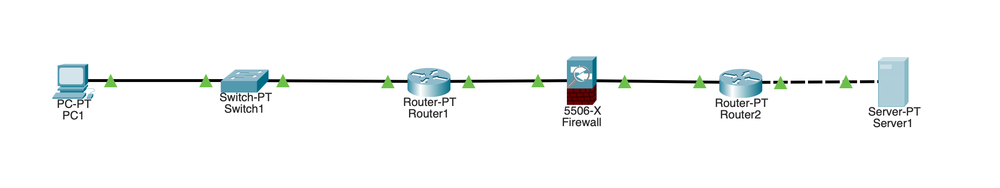
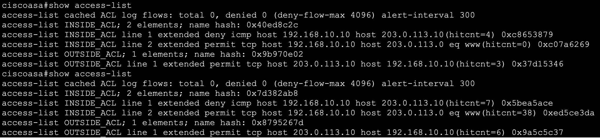

# Lab 06: Firewall & Network Security Devices

## Objective

Build and configure a dedicated firewall in Cisco Packet Tracer to control traffic between a trusted internal network and an untrusted external network.

The lab focused on:

- Cisco ASA firewall configuration
- Inside and outside security zones
- Security levels
- Access Control Lists (ACLs)
- Permit and deny rules
- Source and destination filtering
- Protocol and port filtering
- ACL rule order
- Implicit vs explicit rules
- ACL hit counters
- Firewall troubleshooting
- Least-privilege access

---

## Lab Environment

- Cisco Packet Tracer
- Cisco ASA 5506-X firewall
- Internal router
- External router
- Layer 2 switch
- Client PC
- External web server
- IPv4
- RIPv2
- ICMP
- TCP
- HTTP

---

## Network Topology

The network was divided into trusted and untrusted portions with a dedicated ASA firewall positioned at the security boundary.

The internal router represents the organization's internal routing infrastructure.

The ASA provides the security boundary between the trusted and untrusted networks.

The external router represents infrastructure leading toward an external or Internet-like network.



---

## IP Addressing

### Internal LAN

```text
Network: 192.168.10.0/24

PC
IP Address:      192.168.10.10
Subnet Mask:     255.255.255.0
Default Gateway: 192.168.10.1

R1 Internal Interface:
192.168.10.1/24
```

### R1 to Firewall

```text
Network: 10.0.0.0/30

R1:
10.0.0.1

ASA Inside:
10.0.0.2
```

### Firewall to R2

```text
Network: 10.0.0.4/30

ASA Outside:
10.0.0.5

R2:
10.0.0.6
```

### External Network

```text
Network: 203.0.113.0/24

R2:
203.0.113.1

External Server:
203.0.113.10

Server Default Gateway:
203.0.113.1
```

---

## Initial Connectivity

Before implementing firewall filtering rules, routing was configured throughout the network.

RIPv2 was used to exchange routing information between the Layer 3 devices.

The initial goal was to establish baseline connectivity.

The client successfully reached the external server before security filtering was introduced.

This provided a known-good baseline before intentionally blocking traffic.

---

## Physical Connectivity Troubleshooting

During setup, the connection between the external router and server initially failed.

The router reported:

```text
FastEthernet0/0 is up, line protocol is down
```

The IP addressing was correct, but the Ethernet connection required a crossover cable in the Packet Tracer simulation.

After replacing the cable, the interface became operational.

This demonstrated that Layer 1 and Layer 2 connectivity must be established before troubleshooting Layer 3 addressing.

---

# ASA Security Interfaces

The ASA interfaces initially did not have logical security names.

The internal-facing interface was configured with:

```text
nameif inside
```

The external-facing interface was configured with:

```text
nameif outside
```

Conceptually:

```text
Internal Network
      |
      |
[ INSIDE ]
Security Level 100
      |
     ASA
      |
[ OUTSIDE ]
Security Level 0
      |
      |
External Network
```

The `nameif` command assigns a logical security name to an ASA interface.

This logical name can then be referenced by other firewall commands.

---

# Security Levels

The ASA uses security levels to distinguish between interfaces with different levels of trust.

For this lab:

```text
inside  = 100
outside = 0
```

The inside interface represented the trusted network.

The outside interface represented the untrusted network.

During HTTP testing, Packet Tracer demonstrated that traffic attempting to travel from a lower-security interface toward a higher-security interface required explicit permission.

---

# Access Control Lists

An Access Control List was created to control traffic entering the firewall.

The ACL was named:

```text
INSIDE_ACL
```

ACL names are administrator-defined identifiers.

For example, an ACL could be named:

```text
INSIDE_ACL
WEB_FILTER
INTERNAL_RULES
BLOCK_ICMP
```

The name itself does not determine what the ACL does. The individual rules inside it determine its behavior.

---

# ACL Command Structure

An extended ASA ACL can be read using the following general structure:

```text
access-list NAME extended ACTION PROTOCOL SOURCE DESTINATION [PORT]
```

For example:

```text
access-list INSIDE_ACL extended permit tcp host 192.168.10.10 host 203.0.113.10 eq 80
```

This can be read as:

```text
access-list
→ Create/edit an ACL

INSIDE_ACL
→ ACL name

extended
→ Use detailed filtering criteria

permit
→ Allow matching traffic

tcp
→ Match TCP

host 192.168.10.10
→ Source host

host 203.0.113.10
→ Destination host

eq 80
→ Destination port 80
```

In plain English:

> Allow TCP traffic from 192.168.10.10 to 203.0.113.10 when the destination service is TCP port 80.

---

# Extended ACLs

Extended ACLs allow traffic to be filtered using multiple characteristics.

These can include:

```text
Protocol
Source IP
Destination IP
TCP/UDP Port
Action
```

This allows much more specific rules than simply allowing or blocking all communication.

---

# Permit and Deny

ACL rules contain an action.

```text
permit
```

means matching traffic is allowed.

```text
deny
```

means matching traffic is blocked.

For example:

```text
deny icmp host 192.168.10.10 host 203.0.113.10
```

blocks ICMP traffic from the internal PC to the external server.

---

# Host vs Any

The `host` keyword specifies exactly one IP address.

Example:

```text
host 192.168.10.10
```

means:

```text
Only 192.168.10.10
```

The `any` keyword represents any IP address.

For example:

```text
permit ip any any
```

is extremely broad because it allows IP traffic:

```text
Any Source
     ↓
Any Destination
```

A more restrictive rule such as:

```text
permit tcp host 192.168.10.10 host 203.0.113.10 eq 80
```

limits communication to:

```text
Source:
192.168.10.10

Destination:
203.0.113.10

Protocol:
TCP

Destination Port:
80
```

This provides much more precise traffic control.

---

# Applying an ACL

Creating an ACL does not by itself determine where the ACL processes traffic.

The ACL was applied to the inside interface:

```text
access-group INSIDE_ACL in interface inside
```

This means:

```text
INSIDE_ACL
      ↓
Apply to traffic
ENTERING
the ASA through
the INSIDE interface
```

Conceptually:

```text
PC → R1 → [ INSIDE | ASA | OUTSIDE ] → R2
               ↑
          ACL evaluated
```

A useful distinction is:

```text
access-list
→ Creates the rules

access-group
→ Applies the ACL to an interface
```

---

# ICMP Filtering Test

The first firewall test intentionally blocked ICMP between the client and external server.

The rule was:

```text
access-list INSIDE_ACL extended deny icmp host 192.168.10.10 host 203.0.113.10
```

Before applying the rule:

```text
PC → ping 203.0.113.10

SUCCESS
```

After applying the rule:

```text
PC → ping 203.0.113.10

BLOCKED
```

This demonstrated that the firewall could selectively prevent communication between two hosts.

---

# ACL Hit Counters

The ASA was used to verify that traffic was actually matching the ACL.

The command:

```text
show access-list
```

displayed information similar to:

```text
access-list INSIDE_ACL line 1 extended deny icmp
host 192.168.10.10 host 203.0.113.10
(hitcnt=5)
```

The hit counter showed that five packets had matched the rule.

This provided evidence that the traffic was reaching the firewall and being denied by the intended ACL entry.

---

# HTTP Testing

The external server was configured to provide an HTTP service.

The client attempted to access:

```text
http://203.0.113.10
```

This created TCP communication using destination port:

```text
TCP 80
```

Unlike ICMP, HTTP was intended to remain accessible.

This demonstrated that a firewall can:

```text
ICMP
PC → Server
BLOCK

HTTP
PC → Server
ALLOW
```

Therefore, inability to ping a host does not necessarily mean the host or service is unreachable.

A firewall may block ICMP while permitting application traffic.

---

# Troubleshooting the TCP Handshake

During HTTP testing, the TCP connection initially failed.

Packet Tracer Simulation Mode reported that the ASA would not allow traffic from a lower-security interface toward a higher-security interface unless explicitly permitted.

The initial SYN traveled:

```text
PC → Server

inside → outside
```

The return traffic traveled:

```text
Server → PC

outside → inside
```

An outside ACL was created and applied to explicitly permit the required return traffic in the Packet Tracer simulation.

After correcting the firewall policy, the TCP handshake completed and the webpage successfully loaded.

This demonstrated the importance of checking:

- Traffic direction
- Source and destination
- Security zones
- ACL placement
- TCP handshake behavior
- Return traffic

when troubleshooting firewall connectivity.

---

# Least-Privilege Filtering

The initial ACL contained a broad rule:

```text
permit ip any any
```

This allowed essentially any IP traffic that reached the rule.

The broad permit was removed and replaced with a more specific HTTP rule:

```text
access-list INSIDE_ACL extended permit tcp host 192.168.10.10 host 203.0.113.10 eq 80
```

The resulting policy was conceptually:

```text
192.168.10.10 → 203.0.113.10

HTTP / TCP 80   → ALLOW
ICMP            → DENY
Other Traffic   → DENY
```

This demonstrated the security principle of **least privilege**:

> Only permit the communication that is actually required.

---

# Explicit vs Implicit Rules

An **explicit rule** is one that is directly configured by an administrator.

For example:

```text
deny icmp host 192.168.10.10 host 203.0.113.10
```

is an explicit deny.

Likewise:

```text
permit tcp host 192.168.10.10 host 203.0.113.10 eq 80
```

is an explicit permit.

An **implicit rule** exists automatically without being manually entered.

ACLs contain an implicit deny at the end.

Conceptually:

```text
deny ip any any
```

Therefore, traffic that does not match an explicit permit is ultimately denied.

---

# ACL Rule Order

ACLs are evaluated from top to bottom.

The firewall stops processing when it finds the first matching rule.

For example:

```text
1. deny icmp host 192.168.10.10 host 203.0.113.10
2. permit icmp host 192.168.10.10 host 203.0.113.10
```

An ICMP packet would match rule 1:

```text
ICMP arrives
     ↓
Rule 1 matches
     ↓
DENY
     ↓
STOP
```

Rule 2 would never be evaluated for that packet.

This demonstrated the importance of ACL rule order.

---

# Firewall Policy Decision Process

A simplified ACL decision can be represented as:

```text
Packet enters firewall
        ↓
Check Rule 1
        ↓
Match?
 ┌──────┴──────┐
Yes            No
 ↓              ↓
Take action   Check Rule 2
and stop         ↓
                ...
                 ↓
          No rules match
                 ↓
           Implicit Deny
                 ↓
               DROP
```

This is commonly summarized as:

> First matching rule wins.

---

# Final Verification

At the end of the lab:

```text
PC: 192.168.10.10
Server: 203.0.113.10

ICMP / Ping
❌ Blocked

HTTP / TCP 80
✅ Allowed
```

ACL hit counters were used to verify that traffic matched the expected firewall rules.



This demonstrated that the firewall was not simply blocking or allowing connectivity as a whole.

Instead, it was making decisions based on the characteristics of individual traffic flows.

---

# What I Learned

- A dedicated firewall can separate trusted and untrusted networks.
- ASA interfaces can be assigned logical names using `nameif`.
- ASA security levels represent different levels of interface trust.
- ACLs control which traffic is permitted or denied.
- ACL names are administrator-defined.
- Extended ACLs can filter based on protocol, source, destination, and port.
- `permit` allows matching traffic.
- `deny` blocks matching traffic.
- `host` identifies one specific IP address.
- `any` matches any IP address.
- `permit ip any any` is an extremely broad rule.
- ACLs are evaluated from top to bottom.
- The first matching ACL rule determines the action.
- Traffic that reaches the end of an ACL without being permitted encounters an implicit deny.
- Explicit rules are directly configured.
- Implicit behavior occurs automatically.
- `access-list` creates ACL rules.
- `access-group` applies an ACL to an ASA interface.
- ACL direction determines which traffic is evaluated.
- ACL hit counters help verify whether traffic is matching a rule.
- Firewalls can allow one protocol while denying another between the same hosts.
- Blocking ping does not necessarily mean an application service is unreachable.
- TCP connectivity requires successful communication in both directions.
- Firewall troubleshooting requires checking both the original traffic and return traffic.
- Least privilege means permitting only the communication that is required.
- Physical connectivity should be verified before troubleshooting IP addressing or firewall policy.

---

# Skills Practiced

- Cisco Packet Tracer
- Cisco ASA 5506-X
- Dedicated firewall configuration
- Firewall security zones
- ASA `nameif`
- ASA security levels
- IPv4 addressing
- RIPv2
- Access Control Lists
- Extended ACLs
- Permit rules
- Deny rules
- Source filtering
- Destination filtering
- Protocol filtering
- Port filtering
- ACL direction
- ACL rule ordering
- Implicit deny
- Explicit rules
- Least-privilege access
- ACL hit counters
- `show access-list`
- ICMP testing
- HTTP testing
- TCP handshake troubleshooting
- Packet Tracer Simulation Mode
- Layer 1/2 troubleshooting
- Firewall troubleshooting
