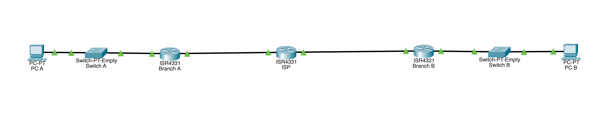
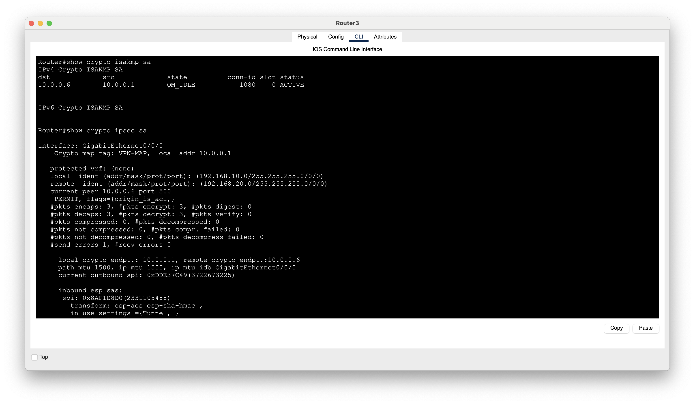

# Lab 07: VPN & Secure Site-to-Site Connectivity

## Objective

Build and configure a site-to-site IPsec VPN in Cisco Packet Tracer to securely connect two private branch networks across an untrusted network.

The lab focused on:

- Site-to-site VPN architecture
- IPsec
- IKE / ISAKMP
- ESP
- AES encryption
- SHA-HMAC integrity
- Pre-shared key authentication
- Diffie-Hellman groups
- Interesting traffic
- Crypto ACLs
- Crypto maps
- VPN peers
- Security Associations
- Security Parameters Index (SPI)
- IPsec tunnel mode
- VPN verification
- ARP troubleshooting

---

## Lab Environment

- Cisco Packet Tracer
- Branch A router
- Branch B router
- ISP router
- Two Layer 2 switches
- Two client PCs
- IPv4
- Routing
- IPsec
- IKE / ISAKMP
- ESP
- AES
- SHA-HMAC

---

# Network Topology

Two private branch networks were connected through an ISP router representing an untrusted external network.

The ISP router provided connectivity between the two sites but was not considered part of either trusted private network.

The goal was to allow the two private networks to communicate securely across this untrusted infrastructure.



---

# IP Addressing

## Branch A

```text
Network:
192.168.10.0/24

PC-A:
IP Address:      192.168.10.10
Subnet Mask:     255.255.255.0
Default Gateway: 192.168.10.1

R1 LAN:
192.168.10.1/24
```

## R1 to ISP

```text
Network:
10.0.0.0/30

R1 WAN:
10.0.0.1

ISP:
10.0.0.2
```

## ISP to R2

```text
Network:
10.0.0.4/30

ISP:
10.0.0.5

R2 WAN:
10.0.0.6
```

## Branch B

```text
Network:
192.168.20.0/24

R2 LAN:
192.168.20.1/24

PC-B:
IP Address:      192.168.20.10
Subnet Mask:     255.255.255.0
Default Gateway: 192.168.20.1
```

---

# Phase 1 — Establish WAN Connectivity

Before configuring the VPN, basic routing was established between the routers.

R1 successfully pinged R2's WAN interface.

This verified that the underlying network was operational before introducing IPsec.

---

# Phase 2 — Establish Branch-to-Branch Connectivity

Routing was configured so the private networks could communicate:

PC-A successfully pinged PC-B before IPsec was configured.

This established another known-good baseline.

If connectivity failed after implementing the VPN, the VPN configuration could then be investigated separately from the underlying routing configuration.

---

# ARP Troubleshooting

The original routers used in the topology did not support the required IPsec commands.

Running:

```text
crypto ?
```

only provided:

```text
key
```

The routers were therefore replaced with models that supported:

```text
crypto isakmp
crypto ipsec
crypto map
```

After replacing the routers, PC-A could no longer successfully reach PC-B.

Packet Tracer Simulation Mode showed that a router was dropping an Ethernet frame because the destination MAC address did not match its interface.

The PC still had an old ARP entry associated with the previous router.

The ARP cache was cleared, forcing the PC to relearn the MAC address of its default gateway.

After relearning the correct MAC address:

```text
PC-A → PC-B

PING SUCCESSFUL
```

This demonstrated that replacing a Layer 3 device can also affect Layer 2 information cached by neighboring devices.

---

# Site-to-Site VPN

A site-to-site VPN was configured between R1 and R2.

```text
Branch A                              Branch B

Private LAN                           Private LAN
    |                                    |
    R1 ================================= R2
              IPsec VPN Tunnel
```

The VPN endpoints were:

```text
R1 WAN:
10.0.0.1

R2 WAN:
10.0.0.6
```

The protected private networks were:

```text
Branch A:
192.168.10.0/24

Branch B:
192.168.20.0/24
```

This distinction is important:

```text
VPN Peers:
10.0.0.1 ↔ 10.0.0.6

Protected Networks:
192.168.10.0/24 ↔ 192.168.20.0/24
```

---

# Interesting Traffic

The routers needed to determine which traffic should be protected by IPsec.

A crypto ACL was used to identify this **interesting traffic**.

On R1:

```text
access-list 110 permit ip 192.168.10.0 0.0.0.255 192.168.20.0 0.0.0.255
```

This identifies traffic traveling:

```text
192.168.10.0/24
        ↓
192.168.20.0/24
```

On R2, the source and destination networks were reversed:

```text
access-list 110 permit ip 192.168.20.0 0.0.0.255 192.168.10.0 0.0.0.255
```

Conceptually:

```text
Packet arrives at VPN router
          ↓
Does it match crypto ACL?
       /        \
     Yes         No
      ↓           ↓
Protect with    Route normally
IPsec
```

The crypto ACL is therefore not being used to block the matching traffic.

Instead, it identifies:

> Which traffic should be protected by the VPN?

---

# Wildcard Masks

The crypto ACL used:

```text
0.0.0.255
```

as the wildcard mask for the `/24` networks.

For example:

```text
192.168.10.0 0.0.0.255
```

matches addresses within:

```text
192.168.10.0/24
```

Wildcard masks operate differently from subnet masks.

```text
Subnet Mask:
255.255.255.0

Wildcard Mask:
0.0.0.255
```

---

# IKE / ISAKMP

IKE / ISAKMP was configured so the two VPN endpoints could negotiate security parameters.

The policy included:

```text
Encryption:     AES
Authentication: Pre-shared key
DH Group:       2
```

Example:

```text
crypto isakmp policy 10
 encryption aes
 authentication pre-share
 group 2
```

A pre-shared key was configured for the remote VPN peer.

Conceptually:

```text
R1                                  R2
 |                                  |
 | ---- VPN negotiation ----------> |
 |                                  |
 | <--- VPN negotiation ----------- |
 |                                  |
 |     Agree on security settings   |
```

---

# Pre-Shared Key

Both VPN endpoints were configured with the same shared secret.

Conceptually:

```text
R1 knows VPN secret
       ↕
R2 knows same VPN secret
```

The pre-shared key allows the VPN peers to authenticate each other during VPN establishment.

A simple key was used only for the lab environment.

Production environments should use appropriately strong credentials.

---

# Diffie-Hellman

The IKE policy used a Diffie-Hellman group.

Diffie-Hellman allows the VPN peers to establish shared cryptographic keying material across an untrusted network.

The important conceptual distinction is:

```text
Pre-shared key
→ Authentication

Diffie-Hellman
→ Key establishment
```

---

# IPsec Transform Set

The IPsec transform set specified how protected traffic would be secured.

The configured transform included:

```text
esp-aes
esp-sha-hmac
```

Conceptually:

```text
ESP
 |
 +-- AES
 |    └── Encryption
 |
 +-- SHA-HMAC
      └── Integrity / Authentication
```

This determines how IPsec protects the actual data traveling between the VPN endpoints.

---

# ESP

ESP stands for:

```text
Encapsulating Security Payload
```

ESP was responsible for protecting the traffic crossing the VPN.

Packet Tracer Simulation Mode showed:

```text
Interesting traffic detected
        ↓
Traffic requires IPsec
        ↓
ESP receives packet
        ↓
Packet encrypted
        ↓
Packet encapsulated
        ↓
IPsec traffic sent across WAN
```

At the receiving VPN router:

```text
IPsec/ESP packet received
        ↓
ESP processes packet
        ↓
Matching SPI located
        ↓
Packet decrypted
        ↓
Original packet recovered
        ↓
Normal routing continues
```

---

# Crypto Map

A crypto map connected the major parts of the IPsec configuration.

Conceptually:

```text
Interesting Traffic
       ↓
Crypto ACL
       |
       |
VPN Peer
       ↓
10.0.0.x
       |
       |
Transform Set
       ↓
ESP + AES + SHA
       |
       ↓
   Crypto Map
```

The crypto map answered three important questions:

```text
WHAT traffic?
→ Crypto ACL

WHO is the remote VPN endpoint?
→ Peer

HOW should the traffic be protected?
→ Transform set
```

The crypto map was then applied to the WAN-facing interface.

---

# VPN Traffic Flow

When PC-A communicates with PC-B:

```text
PC-A
192.168.10.10
       |
       | Normal traffic
       ↓
      R1
       |
       | Traffic matches crypto ACL
       ↓
   ESP Encryption
       |
       |========================|
       |      IPsec Tunnel      |
       |========================|
                 ↓
              ISP Router
                 ↓
       |========================|
                 ↓
                R2
                 |
          ESP Decryption
                 |
                 | Original traffic
                 ↓
               PC-B
          192.168.20.10
```

The ISP provides transport between the sites but does not need to participate in the private branch networks themselves.

---

# IPsec Tunnel Mode

The VPN operated using IPsec tunnel mode.

Conceptually:

```text
ORIGINAL PACKET

192.168.10.10 → 192.168.20.10
        ↓
      R1
        ↓
Original packet protected by IPsec
        ↓
NEW OUTER IP INFORMATION

10.0.0.1 → 10.0.0.6
        ↓
      ISP
        ↓
      R2
        ↓
Decrypt / Decapsulate
        ↓
ORIGINAL PACKET

192.168.10.10 → 192.168.20.10
```

Tunnel mode allows the original private-network packet to be protected while traveling between the VPN gateways.

---

# Security Associations

The VPN was verified using:

```text
show crypto isakmp sa
```

The router reported:

```text
QM_IDLE
ACTIVE
```



This confirmed that the ISAKMP Security Association was established.

A Security Association represents agreed security information used by the VPN peers to communicate securely.

---

# Verifying IPsec

The command:

```text
show crypto ipsec sa
```

was used before and after generating VPN traffic.

Before traffic was generated:

```text
#pkts encaps: 0
#pkts encrypt: 0

#pkts decaps: 0
#pkts decrypt: 0
```

After PC-A generated traffic to PC-B:

```text
#pkts encaps: 3
#pkts encrypt: 3

#pkts decaps: 3
#pkts decrypt: 3
```

This provided direct evidence that IPsec was processing the traffic.

The router also reported:

```text
transform: esp-aes esp-sha-hmac
in use settings ={Tunnel, }
Status: ACTIVE
```

This confirmed that the IPsec Security Association was active and using the configured ESP protection.

---

# Encapsulation and Encryption Counters

The IPsec counters provide useful troubleshooting information.

```text
encaps
→ Packets encapsulated for IPsec

encrypt
→ Packets encrypted before transmission

decaps
→ Received packets removed from IPsec encapsulation

decrypt
→ Received packets decrypted
```

Increasing counters indicate that traffic is actually passing through the VPN.

For example:

```text
PC-A sends traffic
        ↓
R1 encapsulates
        ↓
R1 encrypts
        ↓
VPN
        ↓
R2 receives
        ↓
R2 decrypts
        ↓
R2 decapsulates
        ↓
PC-B receives original traffic
```

---

# Security Parameters Index

Packet Tracer showed an SPI while processing ESP traffic.

SPI stands for:

```text
Security Parameters Index
```

The SPI helps the receiving VPN endpoint identify the Security Association associated with an IPsec packet.

Conceptually:

```text
Encrypted ESP packet arrives
          ↓
       Read SPI
          ↓
Which Security Association
does this packet belong to?
          ↓
Find matching SA
          ↓
Use appropriate security
parameters to process packet
```

The SPI therefore helps the router determine how a particular IPsec packet should be processed.

---

# Simulation Mode Analysis

Packet Tracer Simulation Mode was used to observe IPsec processing.

At the sending VPN router, Packet Tracer reported that:

1. The routing table found a route to the destination.
2. TTL was decremented.
3. The packet was identified as interesting traffic.
4. The packet needed to be encrypted and encapsulated using IPsec.
5. ESP encrypted the packet.
6. The protected data was encapsulated.
7. The IPsec message was transmitted through the WAN interface.

At the receiving router:

1. The IPsec packet was received.
2. ESP processed the incoming PDU.
3. ESP found the matching SPI.
4. The packet was authenticated/decrypted.
5. The recovered traffic continued through normal Layer 3 processing.

This demonstrated that IPsec protection occurs at the VPN gateways rather than at the intermediate ISP router.

---

# Before vs After IPsec

Before the VPN was configured:

```text
PC-A
   |
   ↓
R1
   |
   | Normal routed traffic
   ↓
ISP
   |
   ↓
R2
   |
   ↓
PC-B
```

After the VPN was configured:

```text
PC-A
   |
   | Normal traffic
   ↓
R1
   |
   | IPsec / ESP
   | Encryption
   | Encapsulation
   ↓
ISP
   |
   | Protected traffic
   ↓
R2
   |
   | Decryption
   | Decapsulation
   ↓
PC-B
```

The physical path did not change.

The security applied to traffic crossing that path changed.

---

# Site-to-Site vs Remote-Access VPN

This lab implemented a **site-to-site VPN**.

```text
NETWORK A
    |
VPN Gateway
    |
==================
   VPN Tunnel
==================
    |
VPN Gateway
    |
NETWORK B
```

The VPN connects entire networks through VPN gateways.

This differs from a remote-access VPN:

```text
Individual Remote User
          |
          | VPN
          ↓
    Corporate Network
```

Site-to-site VPN:

> Network ↔ Network

Remote-access VPN:

> Individual device/user ↔ Network

---

# Troubleshooting Workflow

A useful troubleshooting order from this lab was:

```text
1. Verify physical connectivity
           ↓
2. Verify IP addressing
           ↓
3. Verify default gateways
           ↓
4. Verify ARP
           ↓
5. Verify routing
           ↓
6. Verify WAN peer connectivity
           ↓
7. Verify crypto ACL
           ↓
8. Verify IKE / ISAKMP SA
           ↓
9. Verify IPsec SA
           ↓
10. Generate interesting traffic
           ↓
11. Check encrypt/decrypt counters
```

This prevents immediately blaming the VPN when the underlying problem may actually be routing, addressing, or Layer 2 connectivity.

---

# Useful Commands

## Check interfaces

```text
show ip interface brief
```

## Check routing

```text
show ip route
```

## Check ARP

```text
show arp
```

## Check IKE / ISAKMP

```text
show crypto isakmp sa
```

## Check IPsec

```text
show crypto ipsec sa
```

## Check crypto capabilities during configuration

```text
crypto ?
```

---

# What I Learned

- A site-to-site VPN securely connects two networks through VPN gateways.
- The underlying routed network must work before the VPN can work.
- A VPN does not create a new physical path between sites.
- IPsec protects traffic traveling across an existing network path.
- VPN peers are the devices establishing the secure tunnel.
- The VPN peer addresses are different from the protected private networks.
- Crypto ACLs identify interesting traffic that should receive IPsec protection.
- A crypto ACL used for IPsec does not simply mean "block" or "allow" like a firewall ACL.
- IKE / ISAKMP negotiates security information between VPN peers.
- Pre-shared keys can authenticate VPN peers.
- Diffie-Hellman is used during cryptographic key establishment.
- ESP can provide encryption and integrity protection for IPsec traffic.
- AES provides encryption.
- SHA-HMAC provides integrity/authentication functionality.
- Crypto maps connect the crypto ACL, peer, and transform set.
- Crypto maps are applied to the WAN-facing interface.
- IPsec tunnel mode protects the original packet between VPN gateways.
- Security Associations contain security information used for protected communication.
- SPI identifies the appropriate Security Association for an IPsec packet.
- `show crypto isakmp sa` can verify IKE/ISAKMP state.
- `show crypto ipsec sa` can verify IPsec operation.
- Encryption and decryption counters provide evidence that traffic is actually using IPsec.
- Interesting traffic can trigger VPN/IPsec processing.
- Packet Tracer router models do not all support the same crypto features.
- ARP entries can become stale when network hardware is replaced.
- Clearing an ARP cache can force a host to relearn the correct MAC address.
- Successful routing does not automatically mean traffic is protected by a VPN.
- Simulation Mode can be used to observe encryption and decryption at VPN endpoints.

---

# Skills Practiced

- Cisco Packet Tracer
- Site-to-site VPN configuration
- IPsec
- IKE / ISAKMP
- ESP
- AES encryption
- SHA-HMAC
- Pre-shared key authentication
- Diffie-Hellman
- Crypto ACLs
- Wildcard masks
- Interesting traffic
- Crypto maps
- Transform sets
- VPN peers
- Security Associations
- Security Parameters Index
- IPsec tunnel mode
- `show crypto isakmp sa`
- `show crypto ipsec sa`
- VPN verification
- Encryption/decryption counter analysis
- Packet Tracer Simulation Mode
- IPv4 routing
- WAN connectivity
- ARP troubleshooting
- MAC address troubleshooting
- VPN troubleshooting
- Layer 2 troubleshooting
- Layer 3 troubleshooting
