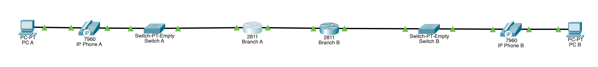
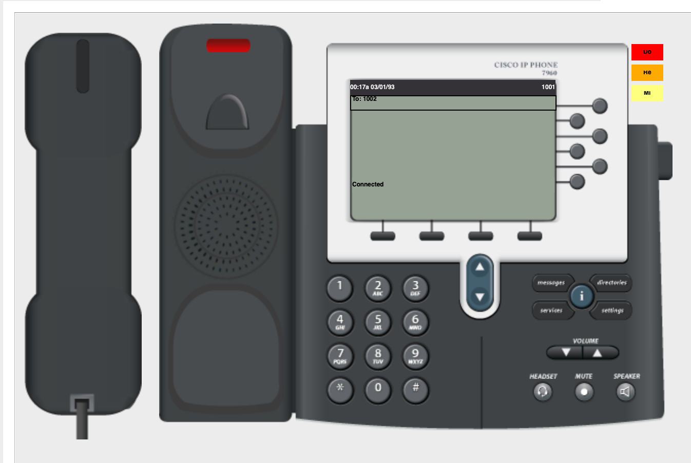
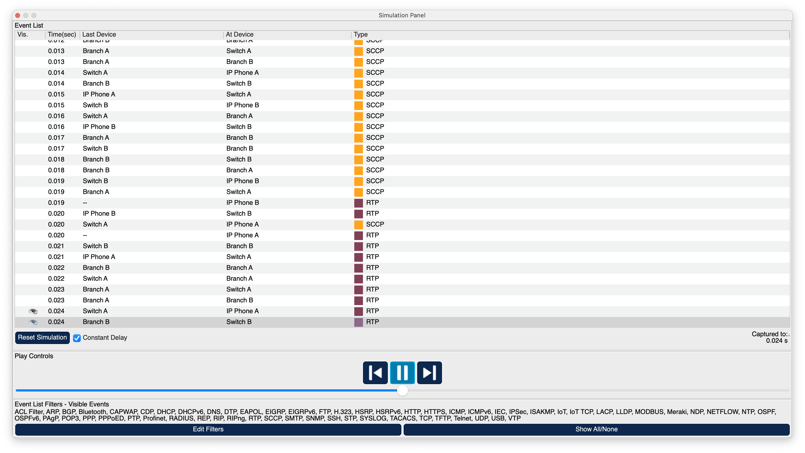
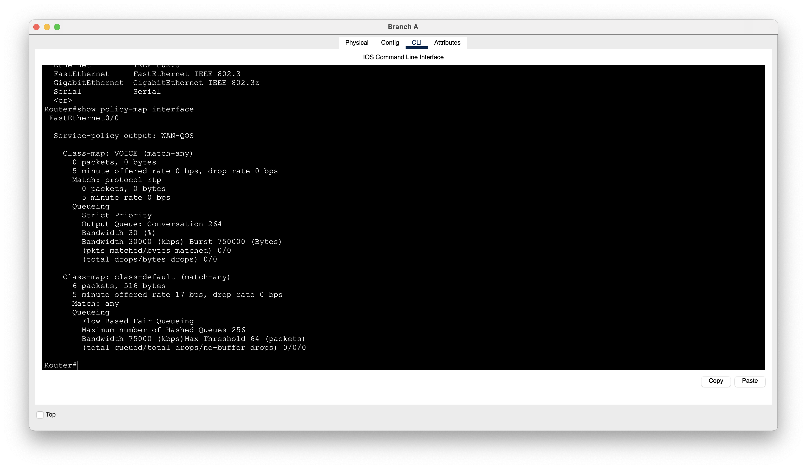
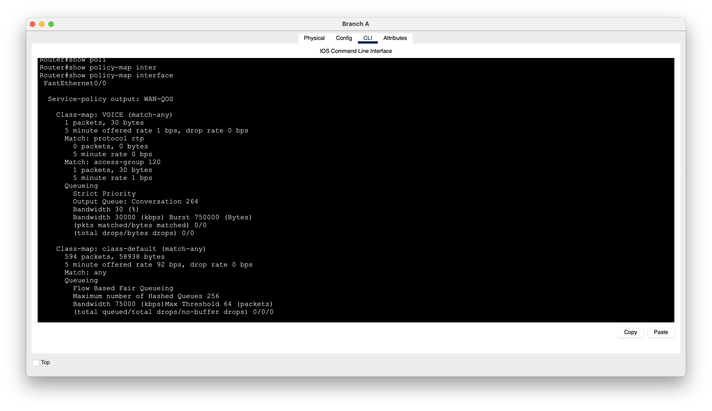

# Lab 09: VoIP & Quality of Service (QoS)

## Objective

Build a functional Voice over IP (VoIP) network in Cisco Packet Tracer and implement Quality of Service (QoS) to prioritize voice traffic.

The lab focused on:

- Cisco IP phones
- VoIP call processing
- DHCP
- DHCP Option 150
- Cisco Unified Communications Manager Express (CME)
- Phone extensions
- SCCP signaling
- RTP voice traffic
- UDP
- Voice traffic characteristics
- QoS classification
- Class maps
- Policy maps
- Priority queuing
- Service policies
- QoS verification

---

## Lab Environment

- Cisco Packet Tracer
- Two routers
- Two Layer 2 switches
- Two Cisco IP phones
- Two PCs
- IPv4
- DHCP
- Cisco CME
- SCCP
- RTP
- UDP
- QoS

---

# Network Topology

Two branch networks were connected across a routed WAN.

Each branch contained an IP phone and workstation.

The PCs were connected through the Ethernet ports provided by the IP phones.

This represents a common office configuration where a workstation and IP phone can share the same physical access location.



---

# IP Addressing

## Branch A

```text
Network:
192.168.10.0/24

R1 LAN:
192.168.10.1

PC-A:
DHCP

IP Phone A:
DHCP
```

## WAN

```text
Network:
10.0.0.0/30

R1:
10.0.0.1

R2:
10.0.0.2
```

## Branch B

```text
Network:
192.168.20.0/24

R2 LAN:
192.168.20.1

PC-B:
DHCP

IP Phone B:
DHCP
```

---

# Phase 1 — Establish Basic Connectivity

Before configuring VoIP, basic IP connectivity was established between the two branch networks.

Both routers were configured with their appropriate LAN and WAN addresses.

Routing allowed communication between:

```text
192.168.10.0/24
        ↕
192.168.20.0/24
```

The PCs successfully received IP addresses and could communicate across the routed network.

This provided a known-good network before adding VoIP services.

---

# DHCP Configuration

Each branch router provided DHCP services for its local network.

Example Branch A configuration:

```text
ip dhcp excluded-address 192.168.10.1 192.168.10.99

ip dhcp pool BRANCH_A
 network 192.168.10.0 255.255.255.0
 default-router 192.168.10.1
```

Branch B used the same structure for:

```text
192.168.20.0/24
```

The PCs and IP phones successfully obtained their addressing information through DHCP.

On the PCs, DHCP leases were manually refreshed when necessary using:

```text
ipconfig /renew
```

---

# DHCP Option 150

The IP phones required additional information beyond a normal IP address and default gateway.

DHCP Option 150 was configured to direct the Cisco IP phones toward the TFTP/CME service.

Example:

```text
ip dhcp pool BRANCH_A
 option 150 ip 192.168.10.1
```

This demonstrated that DHCP can provide specialized configuration information in addition to basic IP addressing.

---

# Cisco CME

Cisco Unified Communications Manager Express (CME) functionality was configured on the router to provide call-processing services.

The telephony service was enabled with configuration similar to:

```text
telephony-service
 max-ephones 2
 max-dn 2
 ip source-address 192.168.10.1 port 2000
 auto assign 1 to 2
```

The router could then support:

```text
2 IP Phones
2 Directory Numbers
```

---

# Directory Numbers

Two extensions were created.

```text
ephone-dn 1
 number 1001

ephone-dn 2
 number 1002
```

After the phones successfully registered, their assigned extensions appeared directly on their displays.

This provided visible confirmation that the phones had registered with the call-processing system.

---

# Testing the Phone System

The phone GUI in Packet Tracer was used to test the completed VoIP configuration.

A call was placed from one extension to the other.

The second phone rang.

The call was answered using the receiving phone's GUI.

This verified that:

```text
Phone registration      ✓
Extension assignment    ✓
Call signaling          ✓
Phone ringing           ✓
Call answering          ✓
Voice session           ✓
```



---

# Observing VoIP Traffic

Packet Tracer Simulation Mode was used to observe what happened during a phone call.

Several different types of traffic appeared during the process.

The two major categories were:

```text
Call signaling
vs.
Voice/media traffic
```

This distinction was important because establishing a phone call and carrying the actual conversation are different networking functions.



---

# SCCP

Packet Tracer showed **SCCP** traffic during call setup.

SCCP stands for:

```text
Skinny Client Control Protocol
```

The Cisco IP phones used SCCP to communicate call-control information with CME.

When each digit were entered on the phone, SCCP messages were sent toward the call-processing router.

Conceptually:

```text
Phone                         CME
  |                            |
  |--- Digit pressed --------->|
  |--- Digit pressed --------->|
  |--- Digit pressed --------->|
  |--- Digit pressed --------->|
  |                            |
  |      Process extension     |
```

For example, dialing:

```text
1002
```

generated signaling associated with the digits being entered.

SCCP therefore handled **call control**, not the actual voice conversation.

---

# Call Signaling vs Voice

The lab demonstrated an important distinction:

```text
SCCP
→ Call signaling/control

RTP
→ Actual real-time voice/media
```

Examples of signaling include:

```text
Phone goes off-hook
Digits are dialed
Call is established
Phone rings
Call is answered
Call ends
```

The actual audio requires a separate media stream.

---

# TCP and SCCP

TCP traffic was also observed alongside SCCP.

SCCP signaling uses TCP for reliable communication between the Cisco IP phone and the call-processing system.

This allows important call-control messages to be reliably exchanged.

---

# RTP

After the call was established, Packet Tracer showed **RTP** traffic.

RTP stands for:

```text
Real-time Transport Protocol
```

RTP carries the actual real-time voice/media traffic.

This was visible within Packet Tracer's PDU information during the active call.

---

# Why Voice Uses UDP

The RTP traffic was transported using UDP.

Voice communication is time-sensitive.

If a voice packet arrives too late, retransmitting it may provide little value because the conversation has already moved forward.

This differs from applications where retransmitting missing data is important.

UDP therefore works well with real-time applications where low delay is particularly important.

---

# Voice Network Requirements

The lab demonstrated why voice traffic has different performance requirements from many ordinary data applications.

VoIP is particularly sensitive to:

### Latency

```text
Packet sent
     ↓
     ↓ Delay
     ↓
Packet received
```

Excessive latency causes noticeable conversational delay.

### Jitter

```text
Packet 1 → 10 ms
Packet 2 → 40 ms
Packet 3 → 15 ms
Packet 4 → 60 ms
```

Jitter is variation in packet arrival timing.

Large variations can negatively affect real-time audio.

### Packet Loss

Excessive packet loss can cause missing or choppy audio.

These characteristics provide a practical reason to use QoS.

---

# Why QoS Was Added

The network contained links with different bandwidth capabilities.

The switches supported higher-speed Ethernet connections while the routed path could provide a lower-capacity forwarding point.

A lower-speed interface can become a bottleneck when traffic demand exceeds available bandwidth.

It is important to distinguish between a **potential bottleneck** and actual **congestion**.

```text
Faster incoming traffic
        ↓
      Router
        ↓
Slower outgoing interface
        ↓
Packets begin waiting
        ↓
Congestion
```

QoS does not create additional bandwidth.

Instead, QoS determines how traffic should be treated when network resources become constrained.

---

# QoS Concept

Without QoS, traffic competes for the available link.

With QoS, voice can receive preferential treatment because it is sensitive to latency, jitter, and packet loss.

---

# QoS Configuration Structure

The QoS configuration followed three major steps:

```text
CLASSIFY
   ↓
TREAT
   ↓
APPLY
```

Cisco configuration components mapped to these steps:

```text
Class Map
→ Identify/classify traffic

Policy Map
→ Define how traffic should be treated

Service Policy
→ Apply the policy to an interface
```

A useful way to remember the process is:

> **Class-map = What traffic?**  
> **Policy-map = What should I do with it?**  
> **Service-policy = Where should I do it?**

---

# Classifying Voice Traffic

A class map was created for voice traffic.

An initial attempt used protocol-based RTP identification.

Packet Tracer displayed the media packets as RTP in Simulation Mode, but the QoS class counters did not increase as expected.



The RTP packet was then inspected directly.

Packet Tracer showed UDP traffic using:

```text
Source Port:
1030

Destination Port:
1030
```

An ACL was used to classify the observed traffic:

```text
access-list 120 permit udp any any eq 1030
```

The class map then referenced the ACL:

```text
class-map match-any VOICE
 match access-group 120
```

This provided a practical example of traffic classification using packet characteristics.

---

# Class Map

The `VOICE` class represented traffic that should receive special QoS treatment.

Conceptually:

```text
Packet enters router
       ↓
Does packet match
VOICE criteria?
      /   \
    Yes    No
     ↓      ↓
  VOICE   Default
  class    class
```

Classification itself does not prioritize the packet.

It simply identifies which category the traffic belongs to.

---

# Policy Map

A QoS policy was created:

```text
policy-map WAN-QOS
 class VOICE
  priority percent 30
 class class-default
  fair-queue
```

The policy contained:

```text
VOICE
→ Priority treatment

class-default
→ Normal/default traffic
```

The `priority` command provided preferential queueing treatment for the voice class.

---

# Class Default

Traffic that did not match the `VOICE` classification was placed into:

```text
class-default
```

This represents traffic not otherwise classified by the configured policy.

During verification, the default class showed traffic counters increasing, proving that the service policy was processing traffic on the interface.

---

# Applying the QoS Policy

The QoS policy was applied to the WAN-facing interface in the outbound direction.

Example:

```text
interface FastEthernet0/0
 service-policy output WAN-QOS
```

The exact interface depends on the router topology.

The outbound direction is important because queueing decisions occur as packets wait to leave an interface.

Conceptually:

```text
Traffic arrives at router
         ↓
Routing decision
         ↓
Packets need WAN interface
         ↓
QoS classification
         ↓
Queueing decision
         ↓
WAN interface
```

---

# QoS Verification

The QoS policy was verified using:

```text
show policy-map interface
```

Initially, traffic was appearing under:

```text
class-default
```

while the `VOICE` class remained at zero.

This showed that:

- The QoS policy was applied.
- Traffic was reaching the policy.
- The voice classifier was not matching the simulated RTP traffic as expected.

After inspecting the RTP PDU and matching the observed UDP port, the `VOICE` class counter increased.



This demonstrated that traffic had successfully matched the voice classification.

---

# QoS Troubleshooting

The QoS troubleshooting process was:

```text
Voice call active
       ↓
Verify RTP in Simulation Mode
       ↓
Check QoS counters
       ↓
VOICE counter remains 0
       ↓
Inspect RTP PDU
       ↓
Identify UDP port
       ↓
Create ACL matching traffic
       ↓
Class-map references ACL
       ↓
Generate voice traffic again
       ↓
VOICE counter increases
```

This demonstrated an important troubleshooting principle:

> If a QoS policy is active but a class counter remains at zero, verify that the classification criteria actually match the traffic.

Packet Tracer provides a simplified simulation of VoIP and QoS, so the generated voice counters were limited. However, successful classification demonstrated the QoS configuration process.

---

# Complete VoIP and QoS Flow

The completed lab can be summarized as:

```text
IP Phone powers on
        ↓
Receives DHCP configuration
        ↓
Receives Option 150
        ↓
Finds CME/TFTP service
        ↓
Registers with CME
        ↓
Receives extension
        ↓
User dials another extension
        ↓
SCCP handles call signaling
        ↓
Call established
        ↓
RTP carries voice using UDP
        ↓
Router classifies voice traffic
        ↓
QoS policy gives voice priority
        ↓
Traffic crosses WAN
```

---

# Major Protocols

| Protocol/Technology | Purpose |
|---|---|
| DHCP | Provides network configuration |
| DHCP Option 150 | Directs Cisco phones toward TFTP/CME services |
| CME | Provides call-processing functionality |
| SCCP | Provides Cisco phone call signaling/control |
| TCP | Provides reliable transport for SCCP signaling |
| RTP | Carries real-time voice/media |
| UDP | Transports RTP media |
| QoS | Provides differentiated traffic treatment |

---

# Key QoS Concepts

### Classification

Identify traffic.

```text
"Is this voice?"
```

### Prioritization

Determine how important that traffic should be during congestion.

```text
"Voice should receive priority."
```

### Queuing

Determine how packets wait for transmission.

```text
Priority Voice Queue
vs.
Normal Data Queue
```

### Policy Application

Determine where the QoS rules operate.

```text
WAN interface
Outbound direction
```

---

# What I Learned

- VoIP allows voice communication to operate across IP networks.
- Cisco IP phones can receive their IP configuration through DHCP.
- DHCP Option 150 can tell Cisco phones where to locate TFTP/CME services.
- CME can provide call-processing services for Cisco IP phones.
- IP phones register with the call-processing system before using assigned extensions.
- Directory numbers represent phone extensions.
- Packet Tracer can simulate dialing, ringing, answering, and ending VoIP calls.
- Call signaling and voice media are separate types of traffic.
- SCCP provides call-control signaling for the Cisco phones used in this lab.
- SCCP signaling uses TCP.
- RTP carries real-time voice/media traffic.
- RTP commonly operates over UDP.
- Real-time voice is sensitive to latency, jitter, and packet loss.
- A lower-bandwidth link is a potential bottleneck but only becomes congested when traffic demand exceeds its capacity.
- QoS does not create additional bandwidth.
- QoS can prioritize delay-sensitive traffic when congestion occurs.
- Class maps classify traffic.
- Policy maps define how classified traffic should be treated.
- Service policies apply QoS policies to interfaces.
- Priority queues can provide preferential treatment to voice traffic.
- `class-default` handles traffic that does not match another configured class.
- `show policy-map interface` can verify QoS classification and policy activity.
- Packet inspection can help troubleshoot incorrect QoS classification.
- QoS counters can show whether traffic is actually matching the intended class.

---

# Skills Practiced

- Cisco Packet Tracer
- VoIP networking
- Cisco IP phones
- DHCP configuration
- DHCP Option 150
- Cisco CME
- `telephony-service`
- Directory numbers
- Phone registration
- Extension configuration
- VoIP call testing
- SCCP
- TCP
- RTP
- UDP
- Packet Tracer Simulation Mode
- PDU inspection
- QoS fundamentals
- Traffic classification
- ACL-based classification
- Class maps
- Policy maps
- Priority queuing
- Default queues
- Service policies
- Outbound QoS
- `show policy-map interface`
- QoS verification
- QoS troubleshooting
- Latency concepts
- Jitter concepts
- Packet loss concepts
- Network bottleneck concepts
